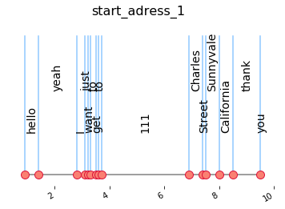

# Speak&Go
2019 - Project for Hackmobility 2019, merging the issues of Inclusion, Mobility and Artificial Intelligence 

## Abstract 

*"Many communities have ample transportation services for their elderly and residents with disabilities who don’t drive, but those services are often too difficult to find, according to a new national survey.*

*Eighty percent of people with a disability and 40 percent of older adults who don’t drive said they couldn’t do all the activities and errands they needed or wanted to do because they couldn’t get around, according to the survey of about 1,650 people by KRC Research for the National Aging and Disability Transportation Center.*

*Many said it had left them feeling frustrated, isolated, trapped and dependent on others."*
The Washington Post

**Speak&Go** is a project building upon this observation. Our vision is to makes transportation easy and affordable for everyone and to remove the mobility barriers that still left people isolated. To do so, we have created a service based on **Speech Recognition** and **Natural Language Processing**. The service is taking a vocal request from the user, that want to go to a place at a given time. It analyses this request and extract location and date information. Those information are used to find the desired place on the map and determine the optimal transportation option for the user (that is adapted to his personal constraints - disability or mobility difficulties). Then, it propose the best options to the user that can easily confirm the trip. In case the trip has been scheduled in advance, a reminder is set. This project especially leverages the **Here API**. 

Two UI have been created: a smartphone widget to easily request the ride and have all the information stored on the phone and a number to call to make the request for users that does not have a smartphone. 

### Equitable 

How can we make transportation more accessible to everyone in society? 
Through this project, our main targets are the **elderly** and the **disables**. Both face barriers when it come to do activities that necessitate to travel. Some people are not used to the new applications that gives access to modern transportation. Some cannot use the traditional tools to make reservations or choose a service, such as blind people. The main issue with those situations is the diffulty of using the UI of traditional services. Our solution

## Speech to text

This module provide the knowledge to do the conversion Speech-To-Text with the use of the **API of Google Speech**.

Use ```STT_run.py``` to provide the audio file you want to convert. 
The output will be a dictionnary of all the words.

We displayed a drawing of the words over a timeline to be able to evaluate the success of the service. 




## Natural Language Processing


Using the text generated in a json format, a NLP **Named Entity Recognition** model is used to extract relevant information out of the request. The function get_information returns a dictionary with two keys: location and date. 

Query to extract location and date information form a json file:

```python
python nlp.py -r request.json
```

## Determination of the best ride

We are using HERE's API (https://developer.here.com/) to query possible mobility options, along with their details such as the mode or services, total time needed, departure time associated, and cost. We can then select a limited few that would be relevant to the user, and suggest those options to the user.

## Service

Two UI are designed, the first one for users that are using smartphones. This one is based on an Android interactive widget.


Yet, as some users, especially among the elderly, might not use smartphones on a daily basis, a simpler UI is also designed. This only consists in calling a number on any usable phone.


